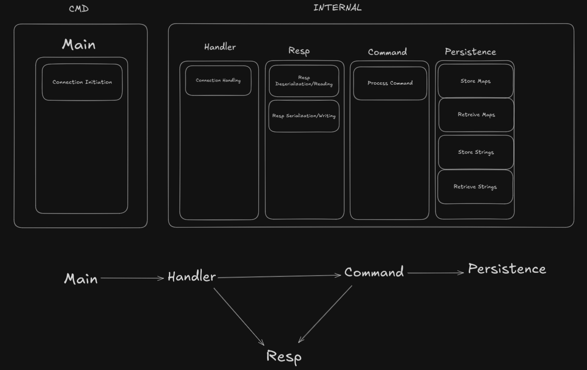

# Gocache

A simple Go-based caching server. Mainly created as a learning experience but can also be used as a lightweight stand-in Redis server.

The project idea came from [build-your-own-x](https://github.com/codecrafters-io/build-your-own-x). There I followed [Build Redis from scratch](https://www.build-redis-from-scratch.dev/en/introduction).

## What Gocache Can Do
Can run as an external service or as an in-memory caching provider. Underneath, like Redis, it's a simple key-value store. It uses Aof (append-only file) to ensure data integrity over restarts.

## Installation
### Prerequisites

- Go 1.21 or higher
- Make (optional, for using Makefile commands)

### Building
```bash
make build
```

## Usage
### Running the Server
```bash
# Run the server
make run
```

## Development
### Setting Up Your Development Environment
It is recommended to enable the githooks to prevent the CI failing after you push:

```bash
git config --local core.hooksPath .githooks/
```

### Project Structure
```
gocache/
├── cmd/              # Application entry points
├── internal/         # Internal packages and core logic
├── .githooks/        # Git hooks for development
├── Makefile          # Build and development commands
```

### Rough Micro-Architecture
Packages and their capabilities

